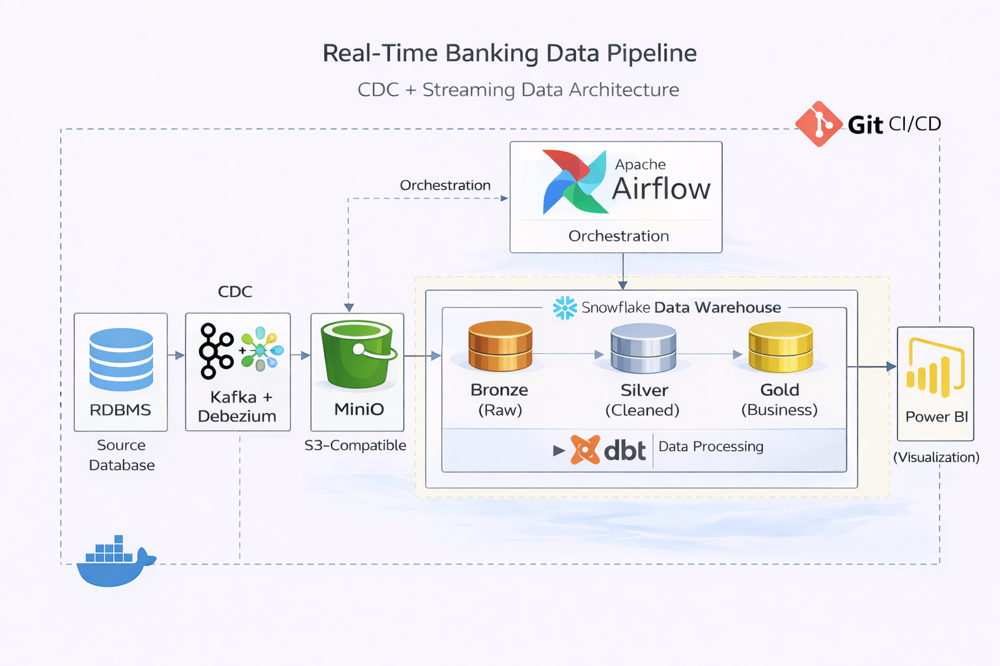

# 🏦 Real-Time Banking Analytics Platform  
Modern CDC + Streaming Data Pipeline

---

## 📖 Overview

This project showcases a **production-style banking analytics pipeline** built using a modern data stack.  
It simulates a transactional banking system and captures database changes in real time using CDC, processes them through streaming infrastructure, and builds analytics-ready warehouse models.

The goal is to replicate how financial data moves from operational systems into reliable analytical layers used for reporting and insights.

---

## 🏗 Architecture

### Data Flow
PostgreSQL  
→ Debezium (CDC)  
→ Kafka Topics  
→ MinIO (S3 Object Storage)  
→ Snowflake (Bronze → Silver → Gold)  
→ Power BI Dashboards  

Airflow orchestrates ingestion and dbt transformations across the warehouse layers.

---

## 🛠 Stack Used

| Layer | Tools |
|------|------|
| Source DB | PostgreSQL |
| CDC | Debezium (Kafka Connect) |
| Streaming | Apache Kafka |
| Storage | MinIO (S3 compatible) |
| Warehouse | Snowflake |
| Transformations | dbt |
| Orchestration | Apache Airflow |
| Visualization | Power BI |
| DevOps | Docker, GitHub Actions |

---

## 🚀 What This Pipeline Demonstrates

- Capturing database-level changes from Postgres WAL  
- Streaming structured events through Kafka  
- Landing raw CDC data into object storage  
- Loading staged data into Snowflake warehouse  
- Layered modeling (Bronze → Silver → Gold)  
- Star schema analytics modeling  
- SCD Type-2 history tracking using dbt snapshots  
- Automated orchestration using Airflow DAGs  
- CI/CD workflows for pipeline reliability  

---

## 📂 Project Structure
├── postgres/                 # OLTP schema & seeds

├── kafka-debezium/           # CDC connector setup

├── consumer/                 # Kafka → MinIO loader

├── data-generator/           # Faker-based data simulation

├── docker/dags/              # Airflow orchestration

├── banking_dbt/              # dbt models & snapshots

├── .github/workflows/        # CI/CD automation

├── docker-compose.yml        # Full stack containers

---

## 🔄 Processing Layers

### Bronze
Raw CDC events ingested from MinIO to Snowflake without modification.

### Silver
Cleaned, deduplicated, validated transactional records.

### Gold
Business-ready fact & dimension tables optimized for analytics.

---

## 📊 Analytics Output

Gold layer tables power real-time dashboards in Power BI showing:
- Customer activity
- Account lifecycle tracking
- Transaction metrics

---

## ⚙ Automation

Airflow handles:
- Continuous ingestion jobs  
- Warehouse loading  
- dbt runs and snapshots  

GitHub Actions automates:
- dbt testing
- pipeline validation
- deployment workflows

---

## 💡 Why This Matters 

This project mirrors real enterprise data engineering:
- Event-driven ingestion
- CDC-based pipelines
- Warehouse modeling best practices
- Automation & reproducibility
- End-to-end analytics delivery

It demonstrates building a **complete data platform**, not just scripts.

---

## 👤 Author
**Sai Prasad B**  
Data Engineer  
GitHub: https://github.com/BsdSaiPrasad

